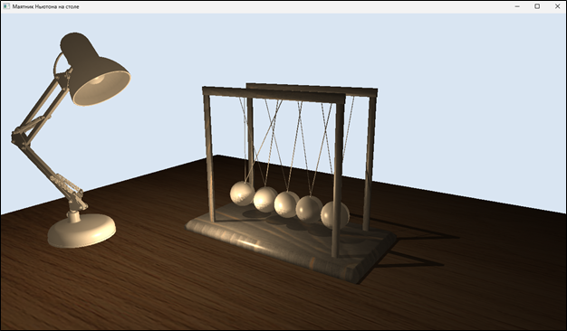

# Newtons-Cradle

Трёхмерная сцена с моделями маятника Ньютона, лампы и стола, выполненная с использованием **OpenTK**.  
Реализована поддержка теней, анимации движения маятника и орбитальной камеры для управления сценой.

## Возможности

- 3D-сцена с освещением и тенями  
- Загрузка 3D-моделей из файлов `.glb`  
- Анимация раскачивания шариков маятника  
- Управление камерой: вращение, приближение и отдаление  
- Простая архитектура: модули для камеры, освещения, моделей и рендера  

## Используемые технологии

- **C# / .NET 8**
- **OpenTK 4.8** - для работы с OpenGL
- **AssimpNet** - для импорта 3D-моделей  
- **GLSL** - шейдеры для освещения и рендеринга теней

## Трёхмерная сцена



## Источники 3D-моделей

| Объект | Источник | Автор |
|:--------:|:-----------:|:--------:|
| **Маятник Ньютона** | [Sketchfab - Newton’s Cradle](https://sketchfab.com/3d-models/newtons-cradle-29f53311a1df478da6170e9a4e24ba77) | **Francesca Cepparulo_3D** |
| **Настольная лампа** | [Sketchfab - Desk Lamp](https://sketchfab.com/3d-models/desk-lamp-2450ec6d3ec84341b28931fe67e063ce) | **uday** |

## Управление

| Клавиша | Действие |
|---------|-----------|
| **Q / E** | Вращение камеры вокруг сцены |
| **+ / -** | Приблизить / отдалить камеру |
| **Пробел** | Включить / выключить анимацию маятника |
| **Esc** | Закрыть приложение |

## Запуск проекта

1. Склонировать репозиторий:
   ```bash
   git clone https://github.com/vadimHey/Newtons-Cradle.git
   ```
2. Открыть решение NewtonsCradle.sln в Visual Studio.
3. Запустить проект без отладки (Ctrl + F5).